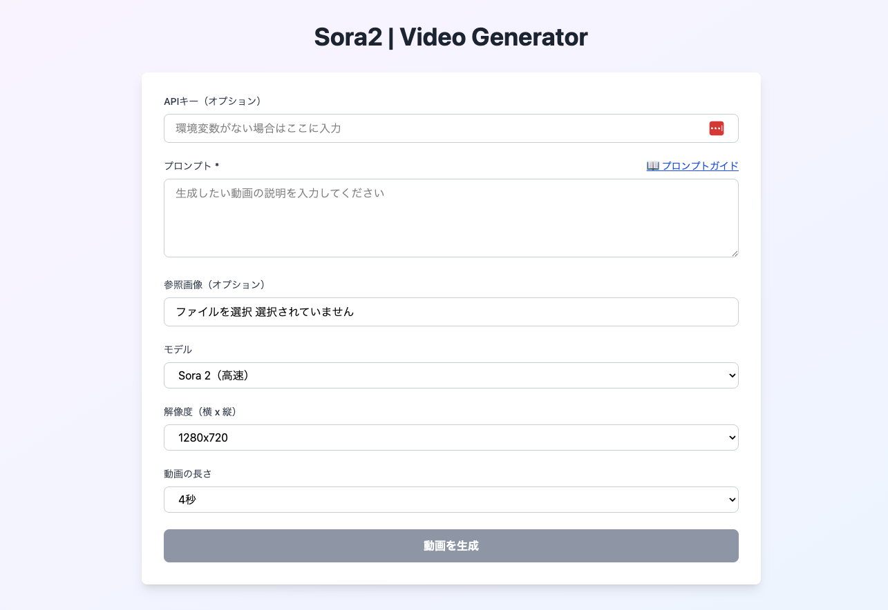

# Sora2 | Video Generator WebUI

OpenAI Sora2 APIを使用した動画生成Webアプリケーションです。



## 機能

- テキストプロンプトからの動画生成
- 画像を参照した動画生成（オプション）
- リアルタイムステータス監視（経過時間表示、進捗確認）
- 環境変数またはWebUIからのAPIキー設定
- 解像度・動画の長さの選択（4/8/12秒）
- モデル別の解像度オプション（Sora 2 / Sora 2 Pro）
- 動画、サムネイル、スプライトシートのダウンロード
- プロンプトガイドへのクイックアクセス

## セットアップ

1. 依存パッケージのインストール:
```bash
npm install
```

2. 環境変数の設定（オプション）:
```bash
cp .env.local.example .env.local
# .env.localファイルにOpenAI APIキーを設定
```

3. 開発サーバーの起動:
```bash
npm run dev
```

4. ブラウザで http://localhost:3000 を開く

## 使い方

1. **APIキー**: 環境変数に設定するか、WebUIの入力欄に直接入力
2. **プロンプト**: 生成したい動画の内容を記述（プロンプトガイドリンクから詳細確認可能）
3. **参照画像**: 画像を最初のフレームとして使用する場合にアップロード（削除も可能）
4. **モデル選択**: Sora 2（高速）またはSora 2 Pro（高品質）を選択
5. **解像度選択**: モデルに応じた解像度を選択
6. **動画の長さ**: 4秒、8秒、12秒から選択
7. **生成ボタン**: クリックして動画生成を開始
8. **ダウンロード**: 完成後、動画・サムネイル・スプライトシートをダウンロード可能

## 技術スタック

- Next.js 15
- TypeScript
- Tailwind CSS
- OpenAI SDK
